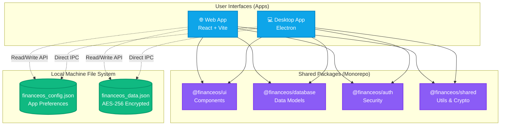

# MyFinanceOS 🚀

> **Premium Local-First Personal & Business Finance Suite for India**

Welcome to **MyFinanceOS**, a fully secure, offline-first financial dashboard built for tracking, managing, and optimizing personal and business wealth. Engineered specifically for the Indian financial ecosystem, MyFinanceOS prioritizes absolute data privacy and security by never sending your sensitive financial data to the cloud.

---

## 🔒 Security First: Your Data, Your Machine
We believe your financial data is yours alone. MyFinanceOS uses a **local-first** architecture:
*   **Zero Cloud Exposure:** Your data never leaves your machine. There are no cloud servers storing your ledgers.
*   **AES-256-GCM Encryption:** All sensitive tables and databases are encrypted on disk with military-grade encryption using your custom Security PIN.
*   **Centralized Local Storage:** Shared effortlessly between the Web and Desktop versions right from your local file system (`~/.financeos`).

---

## ✨ Comprehensive Features

### 💼 Business & Personal Modes
Seamlessly switch between managing your personal wealth and your business cash flows. Maintain strictly isolated ledgers while being able to visualize consolidated net worth in a single click.

### 📈 Advanced Investment Planner
A specialized module to track and model your wealth generation:
*   **Portfolio Distribution:** Visualize how your wealth is split across Equity, Debt, Real Estate, and Alternatives.
*   **Sub-Category Tracking:** Drill down into specific mutual funds, stocks, fixed deposits, and PF contributions.
*   **Goal Tracking:** Model expected ROIs and track progress toward retirement or major purchase goals.

### 💸 Double-Entry Ledger & Cash Flow
A robust, professional-grade accounting engine powers the background:
*   Track granular income streams, exact expense categories, and internal account transfers.
*   Tag and filter transactions instantly.

### 📊 Sankey Diagrams (Cash Flow Visualizer)
Interactive, beautiful Sankey charts provide an immediate visual representation of your money's journey—from where it was earned (Income Nodes) to exactly where it was spent (Expense Nodes).

### 🏛️ India-Specific Tax View
Built for the Indian tax ecosystem:
*   Quickly estimate your tax liabilities under the **Old vs. New Tax Regimes**.
*   Track standard deductions, 80C investments, HRA, and business expenses for accurate forecasting.

### 🤖 AI Chat Assistant
Your personal, privacy-first financial analyst. Simply ask questions like, *"How much did I spend on dining out last month?"* or *"What is my current liquid net worth?"* and the AI will analyze your local data to give you instant insights.

---

## 🏗️ Architecture & Data Flow



---

## 🛠️ Tech Stack & Monorepo Structure
MyFinanceOS uses **npm workspaces** to maintain a modern, modular architecture.

*   **`apps/web`**: The core frontend built with React, Vite, and TypeScript.
*   **`apps/desktop`**: An Electron wrapper that packages the web app into a native Windows executable with system-level IPC bindings.
*   **`packages/ui`**: A shared design system featuring sleek, modern glassmorphic components and Tailwind/CSS styles.
*   **`packages/database`**: The local-first JSON storage engine and data models.
*   **`packages/auth`**: Security modules handling PIN hashing (Argon2/Bcrypt equivalents) and AES-256-GCM payloads.
*   **`packages/shared`**: Universal utilities, date formatting, Indian Rupee (INR) currency logic, and types.

---

## 🚀 Getting Started

### Prerequisites
Make sure you have Node.js (v18+) and `npm` installed on your machine.

### Installation

1. **Clone the repository:**
   ```bash
   git clone https://github.com/AnuroopSrivastava/MyFinanceOS.git
   cd MyFinanceOS
   ```

2. **Install all workspace dependencies:**
   ```bash
   npm run install:all
   ```

### Development Scripts

*   **Start Everything:**
    ```bash
    npm run dev
    ```
    *(Boots up both the Vite Web Server and the Electron Desktop app simultaneously with hot-reloading.)*

*   **Run Tests (Vitest):**
    ```bash
    npm run test
    ```
    *(Executes unit tests across the database, shared utils, and UI components.)*

*   **Code Linting:**
    ```bash
    npm run lint
    ```

### Building for Production
To package the Desktop `.exe` for Windows:
```bash
npm run package
```
*The compiled, ready-to-install executable will be available in `apps/desktop/release`.*

---
*Built with ❤️ for secure, intelligent financial tracking.*
