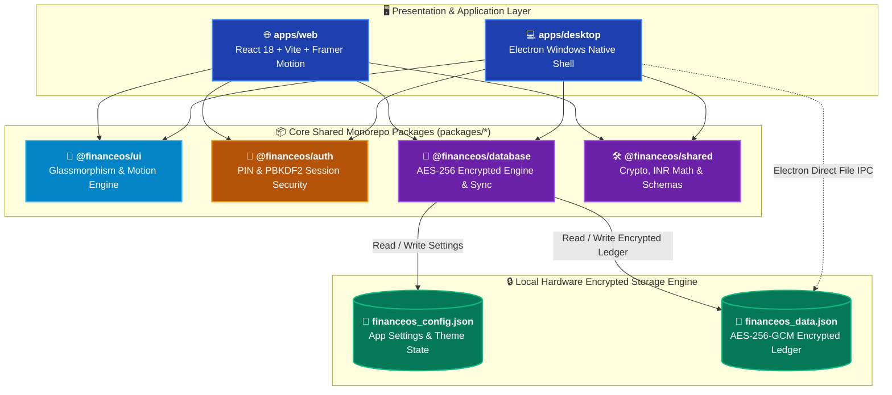
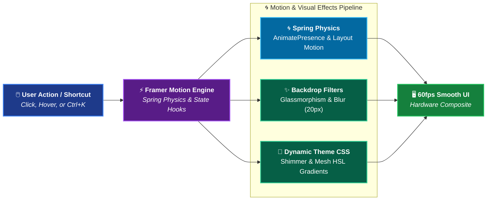
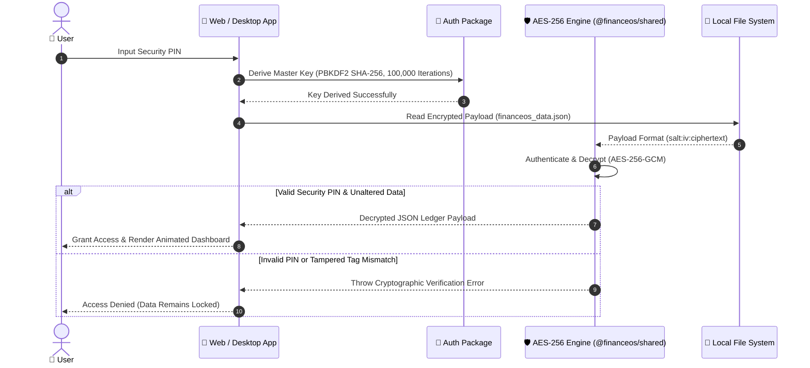

<div align="center">

  

  # MyFinanceOS 🚀

  **Premium Local-First Personal & Business Finance Suite for India**

  *Absolute Data Privacy • AES-256-GCM Hardware Encryption • 60fps Glassmorphism UI • Zero Cloud Footprint • India Tax Intelligence*

  ---

  [](https://www.typescriptlang.org/)
  [](https://reactjs.org/)
  [](https://www.framer.com/motion/)
  [](https://www.electronjs.org/)
  [](https://vitejs.org/)
  [](https://en.wikipedia.org/wiki/Galois/Counter_Mode)
  [](https://vitest.dev/)
  [](https://nodejs.org/)
  [](LICENSE)

  <br />

  [✨ Key Features](#-key-features) • [💡 Deep-Dive Modules](#-deep-dive-financial-modules) • [🎨 Visuals & Animations](#-smooth-animations--glassmorphism-ui) • [🏗️ Architecture](#%EF%B8%8F-system-architecture) • [🔐 Security](#-security--privacy-model) • [💻 Tech Stack](#-technology-stack) • [⚡ Quick Start](#-quick-start-guide)

</div>

---

## 📖 Overview

**MyFinanceOS** is an ultra-secure, local-first financial management platform engineered specifically for the Indian financial landscape. Built for high-net-worth individuals, freelancers, and small business owners, MyFinanceOS combines **bank-grade local AES-256-GCM encryption** with a **state-of-the-art glassmorphism user interface** featuring 60fps micro-animations, dynamic theme engines, and seamless keyboard-driven navigation.

From tracking personal liquid net worth across Indian mutual funds, equities, FDs, gold, and real estate, to managing dual-entry business ledgers with GST & income tax forecasts, MyFinanceOS provides real-time analytical clarity with zero cloud exposure.

---

## ✨ Key Features

| Feature | Description | UX & Performance Highlight |
| :--- | :--- | :--- |
| 🛡️ **Zero Cloud Storage** | All transaction ledgers, bank records, and vault assets remain strictly on your local disk. | 100% Privacy & Zero Latency |
| 🔐 **AES-256-GCM Encryption** | Authenticated hardware-accelerated encryption using PBKDF2 (100,000 iterations) derived from your Security PIN. | Hardware-Accelerated Security |
| 🔄 **Cross-Tab Encrypted Sync** | Real-time BroadcastChannel synchronization across multiple browser tabs with AES-256 payload protection. | Instant Multi-Tab State Sync |
| 🎨 **Glassmorphism & Smooth Motion** | Fluid interface with backdrop blur filters, 60fps tab transitions, and animated glass cards powered by Framer Motion. | Premium Visual Experience |
| ⚡ **Command Palette (`Ctrl+K`)** | Instant keyboard-driven global search across modules, recent transactions, actions, and settings. | Lightning Fast Navigation |
| 💼 **Dual Business & Personal Suites** | Seamlessly toggle between personal wealth management and business accounting with segregated ledgers. | Multi-Entity Management |
| 📊 **Sankey Cash Flow Graph** | Interactive node visualizer tracing complete income-to-expense allocations and capital distributions. | Real-Time Visual Insights |
| 🏛️ **India Tax Optimizer** | Real-time comparison between **Old vs. New Indian Tax Regimes** with 80C, HRA, 80D, and capital gains tracking. | Tailored for India |
| 📈 **Multi-Asset Portfolio Manager** | Unified net worth tracking across Indian Equities, Mutual Funds, FDs, Gold, Real Estate, US Stocks, and Crypto. | Comprehensive Portfolio View |
| 📐 **EMI & Amortization Engine** | Interactive loan EMI calculator, pre-payment impact visualizer, and interest breakdown schedule. | Smart Debt Optimization |
| 🎯 **Goal & FIRE Planner** | Retirement readiness calculator, SIP target trackers, and loan payoff progress monitors. | Financial Freedom Tools |
| 🔐 **Encrypted Vault** | Securely store sensitive documents (PAN, Aadhaar, Property Deeds, ITR filings) inside the encrypted data payload. | Document Privacy |
| 📱 **Cross-Platform & Mobile Ready** | Native Windows desktop app via Electron shell, plus web app with touch navigation drawers and responsive navbar. | Desktop & Web Ready |

---

## 💡 Deep-Dive Financial Modules

### 🏦 1. Personal Wealth & Net Worth Tracker
- **Multi-Asset Portfolio**: Real-time aggregation of Indian Mutual Funds, Equities (NSE/BSE), Fixed Deposits, Physical Gold/SGBs, Real Estate, US Equities, and Cryptocurrency.
- **Visual Analytics**: Interactive Recharts graphs showing historical net worth growth, asset allocation pie charts, and monthly liquid capital metrics.

### 🏛️ 2. India Tax Optimizer Engine (FY 2024-25 / AY 2025-26)
- **Regime Comparison**: Dynamic side-by-side computation of tax liability under the **Old Tax Regime** vs. **New Tax Regime**.
- **Deductions Support**: Automatically calculates Section 80C (₹1.5L cap), 80D (Health Insurance), 80CCD(1B) (NPS ₹50k), HRA (House Rent Allowance exemption), and Standard Deduction (₹75k for New / ₹50k for Old).
- **Capital Gains Forecast**: Short-Term (STCG) vs. Long-Term (LTCG) tax calculations for Indian equities and mutual funds.

### 📐 3. EMI & Loan Amortization Calculator
- **Schedule Breakdown**: Generate complete monthly payment schedules splitting principal vs. interest components.
- **Pre-Payment Impact**: Simulate lump-sum or recurring extra principal payments to calculate total interest saved and tenure reduction.

### 🏢 4. Business Ledger & GST Accounting Suite
- **Dual-Entry Bookkeeping**: Segregated business ledgers for freelancers and small businesses.
- **GST Invoicing**: Generate GST-compliant invoices with CGST, SGST, and IGST breakdowns.
- **Profit & Loss**: Real-time business revenue tracking, operational expense categorization, and estimated quarterly advance tax calculations.

---

## 🎨 Smooth Animations & Glassmorphism UI

MyFinanceOS prioritizes visual excellence and tactile responsiveness. The UI engine incorporates modern web design standards to deliver a luxury fintech aesthetic:

### 🌟 Motion & Visual Highlights
- **60fps Fluid Page Transitions**: Seamless view switching powered by `framer-motion` layout animations and spring physics.
- **Glassmorphism Panels (`.glass-panel`, `.glass-widget`)**: Multi-layered backdrop blur (`16px-20px`), soft translucent borders (`hsla(0,0%,100%,0.08)`), and floating elevation effects.
- **Dynamic Shimmer & Glow Effects**: Keyframe-animated glowing borders (`@keyframes shimmerSlide`, `pulseGlow`) highlighting active widgets and card hover states.
- **Micro-Interactions**: Hover-scaled action buttons, animated stat numbers, staggered list item reveals, and smooth progress ring animations.
- **Custom Multi-Theme Engine**:
  - 🌊 **Glass Cyan** (Deep slate dark theme with cyan accent - *Default*)
  - 🌿 **Glass Emerald** (Soft dark theme with emerald green accents)
  - 👑 **Glass Gold** (Warm luxury dark theme with amber/gold accents)
  - ☀️ **Light Mode** (Crisp high-contrast theme for bright environments)

---

## 🏗️ System Architecture

MyFinanceOS operates as a **modular monorepo workspace**. Core logic, local storage engines, authentication, and design tokens are separated into reusable internal packages (`packages/*`), consumed cleanly by both the web app (`apps/web`) and desktop shell (`apps/desktop`).


```mermaid
flowchart TD
    classDef client fill:#1e40af,stroke:#3b82f6,stroke-width:2px,color:#fff;
    classDef uiSys fill:#0284c7,stroke:#38bdf8,stroke-width:2px,color:#fff;
    classDef corePkg fill:#6b21a8,stroke:#a855f7,stroke-width:2px,color:#fff;
    classDef authPkg fill:#b45309,stroke:#f59e0b,stroke-width:2px,color:#fff;
    classDef diskStore fill:#047857,stroke:#10b981,stroke-width:2px,color:#fff;

    subgraph AppLayer["🖥️ Presentation & Application Layer"]
        direction LR
        Web["🌐 <b>apps/web</b><br/>React 18 + Vite + Framer Motion"]:::client
        Desktop["💻 <b>apps/desktop</b><br/>Electron Windows Native Shell"]:::client
    end

    subgraph PackageLayer["📦 Core Shared Monorepo Packages (packages/*)"]
        direction LR
        UI["🎨 <b>@financeos/ui</b><br/>Glassmorphism & Motion Engine"]:::uiSys
        Auth["🔑 <b>@financeos/auth</b><br/>PIN & PBKDF2 Session Security"]:::authPkg
        DB["💾 <b>@financeos/database</b><br/>AES-256 Encrypted Engine & Sync"]:::corePkg
        Shared["🛠️ <b>@financeos/shared</b><br/>Crypto, INR Math & Schemas"]:::corePkg
    end

    subgraph StorageLayer["🔒 Local Hardware Encrypted Storage Engine"]
        direction LR
        ConfigFile[("📄 <b>financeos_config.json</b><br/>App Settings & Theme State")]:::diskStore
        DataFile[("🔐 <b>financeos_data.json</b><br/>AES-256-GCM Encrypted Ledger")]:::diskStore
    end

    %% Client Layer to Packages
    Web --> UI
    Web --> Auth
    Web --> DB
    Web --> Shared

    Desktop --> UI
    Desktop --> Auth
    Desktop --> DB
    Desktop --> Shared

    %% Package Layer to File Storage
    DB -->|Read / Write Settings| ConfigFile
    DB -->|Read / Write Encrypted Ledger| DataFile
    Desktop -.->|Electron Direct File IPC| DataFile
```

---

## 🎨 UI Rendering & Motion Engine Pipeline


```mermaid
flowchart LR
    classDef eventNode fill:#1e3a8a,stroke:#3b82f6,stroke-width:2px,color:#fff;
    classDef engineNode fill:#581c87,stroke:#a855f7,stroke-width:2px,color:#fff;
    classDef motionNode fill:#0369a1,stroke:#38bdf8,stroke-width:2px,color:#fff;
    classDef visualNode fill:#065f46,stroke:#34d399,stroke-width:2px,color:#fff;
    classDef renderNode fill:#15803d,stroke:#22c55e,stroke-width:2px,color:#fff;

    UserEvent["🖱️ <b>User Action / Shortcut</b><br/><i>Click, Hover, or Ctrl+K</i>"]:::eventNode --> MotionDispatch["⚡ <b>Framer Motion Engine</b><br/><i>Spring Physics & State Hooks</i>"]:::engineNode

    subgraph MotionProcessing["🌀 Motion & Visual Effects Pipeline"]
        direction TB
        Physics["🌀 <b>Spring Physics</b><br/>AnimatePresence & Layout Motion"]:::motionNode
        GlassBlur["✨ <b>Backdrop Filters</b><br/>Glassmorphism & Blur (20px)"]:::visualNode
        Themes["👑 <b>Dynamic Theme CSS</b><br/>Shimmer & Mesh HSL Gradients"]:::visualNode
    end

    MotionDispatch --> Physics
    MotionDispatch --> GlassBlur
    MotionDispatch --> Themes

    Physics --> GPUComposite["🖥️ <b>60fps Smooth UI</b><br/><i>Hardware Composite</i>"]:::renderNode
    GlassBlur --> GPUComposite
    Themes --> GPUComposite
```

---

## 🔐 Security & Privacy Model

Your Security PIN never leaves local RAM and is never saved in plain text. Hardware Web Crypto API drives PBKDF2 key derivation and AES-256-GCM encryption.


```mermaid
sequenceDiagram
    autonumber
    actor User as 👤 User
    participant App as 📱 Web / Desktop App
    participant Auth as 🔑 Auth Package
    participant Engine as 🛡️ AES-256 Engine (@financeos/shared)
    participant Storage as 💾 Local File System

    User->>App: Input Security PIN
    App->>Auth: Derive Master Key (PBKDF2 SHA-256, 100,000 Iterations)
    Auth-->>App: Key Derived Successfully
    App->>Storage: Read Encrypted Payload (financeos_data.json)
    Storage-->>Engine: Payload Format (salt:iv:ciphertext)
    Engine->>Engine: Authenticate & Decrypt (AES-256-GCM)

    alt Valid Security PIN & Unaltered Data
        Engine-->>App: Decrypted JSON Ledger Payload
        App-->>User: Grant Access & Render Animated Dashboard
    else Invalid PIN or Tampered Tag Mismatch
        Engine-->>App: Throw Cryptographic Verification Error
        App-->>User: Access Denied (Data Remains Locked)
    end
```

---

## 💻 Technology Stack

### **Frontend & UI Core**
- **React 18**: Reactive component architecture with custom hooks.
- **Framer Motion 12**: Hardware-accelerated fluid UI transitions, layout animation, and modal reveals.
- **TypeScript 5.3**: Strict typing across apps and workspace packages.
- **Vite 5.4**: Instant HMR and optimized production bundling.
- **Tailwind CSS & Custom Glassmorphism CSS**: Bespoke glass design tokens, keyframe animations, and backdrop blur variables.
- **Lucide React**: Vector iconography set.
- **Recharts**: Responsive canvas & SVG charting for net worth trends, asset breakdowns, and cash flows.

### **Desktop Platform & Security**
- **Electron 43**: Native Windows desktop shell with secure IPC channels.
- **Web Crypto API**: Hardware-accelerated AES-256-GCM cipher engine (`@financeos/shared/crypto`).
- **BroadcastChannel API**: Encrypted cross-tab state sync across browser windows.
- **IndexedDB & LocalStorage**: Fast client-side cache and theme state storage.

### **Testing & QA**
- **Vitest**: Fast unit test runner for monorepo packages.
- **Playwright**: End-to-end integration and onboarding test suite (`e2e/`).
- **ESLint & TypeScript**: Static code analysis and strict type verification.

---

## 📁 Monorepo Structure

```
MyFinanceOS/
├── 📁 apps/
│   ├── 🌐 web/                  # React 18 + Vite + Framer Motion Web App
│   └── 💻 desktop/              # Electron Native Packaging & IPC Shell
│
├── 📁 packages/
│   ├── 🎨 ui/                   # Shared Glassmorphism System, Animations & Themes
│   ├── 💾 database/             # AES-256 Encrypted Local Storage Engine & Cross-Tab Sync
│   ├── 🔑 auth/                 # Local PIN Hashing & PBKDF2 Session Security
│   └── 🛠️ shared/               # AES-GCM Crypto, INR Math Engine & Type Definitions
│
├── 📁 e2e/                      # Playwright End-to-End Integration Suite
└── 📄 package.json              # Monorepo Workspace Configuration
```

---

## ⚡ Quick Start Guide

### Prerequisites
- **Node.js**: `v18.0.0` or higher (Fully optimized for **Node 22.x LTS**)
- **npm**: `v9.0.0` or higher

### Installation

1. **Clone the repository:**
   ```bash
   git clone https://github.com/AnuroopSrivastava/MyFinanceOS.git
   cd MyFinanceOS
   ```

2. **Install workspace dependencies:**
   ```bash
   npm run install:all
   ```

---

## 🛠️ Development & Build Scripts

| Command | Action |
| :--- | :--- |
| `npm run dev` | **Start All**: Launches Standalone Web Dev Server (`http://localhost:5173`) & Electron Shell simultaneously |
| `npm run dev:web` | Start Vite Web Application standalone with hot reloading |
| `npm run dev:desktop` | Start Electron Desktop Shell in watch mode |
| `npm run build:libs` | Compile all shared packages (`@financeos/*`) |
| `npm run build:web` | Build production web bundle to `apps/web/dist` |
| `npm run test` | Run full unit test suite via Vitest |
| `npm run test:e2e` | Execute Playwright E2E integration tests |
| `npm run lint` | Run ESLint static check across monorepo |
| `npm run package` | Package standalone Windows `.exe` desktop installer into `apps/desktop/release` |

---

## 🤝 Contributing

Contributions are welcome! If you'd like to enhance MyFinanceOS, add new Indian financial integrations, or improve animations:

1. Fork the Repository.
2. Create your Feature Branch (`git checkout -b feature/AmazingFeature`).
3. Commit your Changes (`git commit -m 'Add AmazingFeature'`).
4. Push to the Branch (`git push origin feature/AmazingFeature`).
5. Open a Pull Request.

---

<div align="center">

  *Built with ❤️ for privacy-minded financial independence in India.*

</div>
