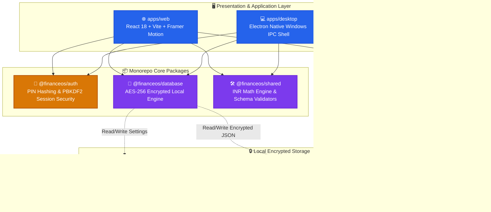
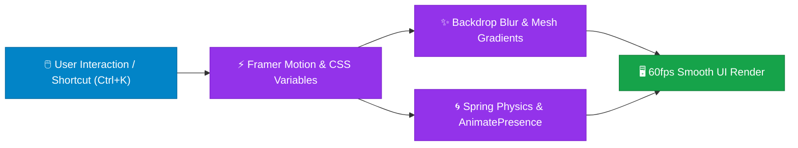
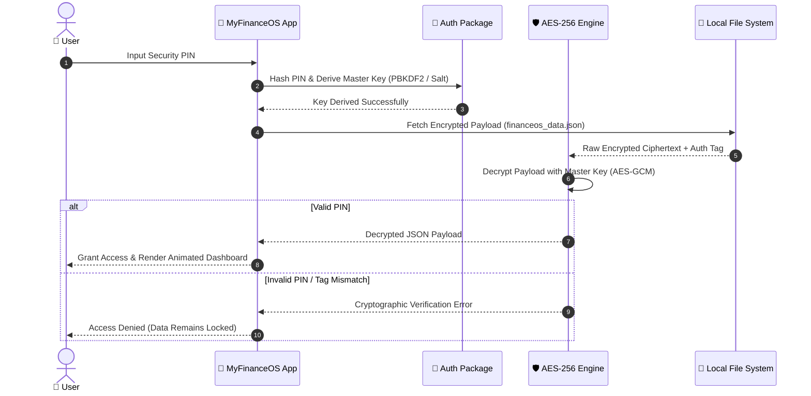

<div align="center">

  

  # MyFinanceOS 🚀

  **Premium Local-First Personal & Business Finance Suite for India**

  *Absolute Data Privacy • AES-256-GCM Encrypted • 60fps Smooth Micro-Animations • Zero Cloud Footprint • India-Specific Tax Intelligence*

  ---

  [](https://www.typescriptlang.org/)
  [](https://reactjs.org/)
  [](https://www.framer.com/motion/)
  [](https://www.electronjs.org/)
  [](https://vitejs.org/)
  [](https://en.wikipedia.org/wiki/Galois/Counter_Mode)
  [](https://vitest.dev/)
  [](LICENSE)

  <br />

  [✨ Key Features](#-key-features) • [🎨 Visuals & Animations](#-smooth-animations--glassmorphism-ui) • [🏗️ Architecture](#%EF%B8%8F-system-architecture) • [🔐 Security](#-security--privacy-model) • [💻 Tech Stack](#-technology-stack) • [⚡ Quick Start](#-quick-start-guide)

</div>

---

## 📖 Overview

**MyFinanceOS** is an ultra-secure, local-first financial management platform engineered specifically for the Indian financial landscape. Built for high-net-worth individuals, freelancers, and small business owners, MyFinanceOS combines **bank-grade local encryption** with a **state-of-the-art glassmorphism user interface** featuring 60fps micro-animations, dynamic theme engines, and seamless navigation.

From tracking personal liquid net worth across Indian mutual funds, equities, FDs, gold, and real estate, to managing dual-entry business ledgers with GST & income tax forecasts, MyFinanceOS provides real-time analytical clarity with zero cloud exposure.

---

## ✨ Key Features

| Feature | Description | UX & Performance Highlight |
| :--- | :--- | :--- |
| 🛡️ **Zero Cloud Storage** | All transaction ledgers, bank records, and vault assets remain strictly on your local disk. | 100% Privacy & Zero Latency |
| 🔐 **AES-256-GCM Encryption** | Authenticated hardware-accelerated encryption using PBKDF2/Argon2 derived keys from your Security PIN. | Hardware-Accelerated Security |
| 🎨 **Glassmorphism & Smooth Motion** | Fluid interface with backdrop blur filters, 60fps tab transitions, and animated glass cards powered by Framer Motion. | Premium Visual Experience |
| ⚡ **Command Palette (`Ctrl+K`)** | Instant keyboard-driven global search across modules, recent transactions, actions, and settings. | Lightning Fast Navigation |
| 💼 **Dual Business & Personal Suites** | Seamlessly toggle between personal wealth management and business accounting with segregated ledgers. | Multi-Entity Management |
| 📊 **Sankey Cash Flow Graph** | Interactive node visualizer tracing complete income-to-expense allocations and capital distributions. | Real-Time Visual Insights |
| 🏛️ **India Tax Optimizer** | Real-time comparison between **Old vs. New Indian Tax Regimes** with 80C, HRA, 80D, and capital gains tracking. | Tailored for India |
| 📈 **Multi-Asset Portfolio Manager** | Unified net worth tracking across Indian Equities, Mutual Funds, FDs, Gold, Real Estate, US Stocks, and Crypto. | Comprehensive Portfolio View |
| 🎯 **Goal & FIRE Planner** | Interactive retirement, SIP goal, and loan EMI amortization calculators with dynamic progress visuals. | Financial Freedom Tools |
| 🔐 **Encrypted Vault** | Securely store sensitive documents (PAN, Aadhaar, Property Deeds, ITR filings) inside the encrypted data payload. | Document Privacy |
| 🤖 **Local AI Financial Analyst** | Natural language financial queries executed 100% offline against local memory models. | Smart Offline AI |
| 📱 **Cross-Platform & Mobile Responsive** | Native Windows desktop app via Electron shell, plus web app with touch navigation drawers and bottom navbar. | Desktop & Web Ready |

---

## 🎨 Smooth Animations & Glassmorphism UI

MyFinanceOS prioritizes visual excellence and tactile responsiveness. The UI engine incorporates modern web design standards to deliver a luxury fintech aesthetic:

### 🌟 Motion & Visual Highlights
- **60fps Fluid Page Transitions**: Seamless view switching powered by `framer-motion` layout animations and spring physics.
- **Glassmorphism Panels (`.glass-panel`, `.glass-widget`)**: Multi-layered backdrop blur (`16px-20px`), soft translucent borders (`hsla(0,0%,100%,0.08)`), and floating elevation effects.
- **Dynamic Shimmer & Glow Effects**: Keyframe-animated glowing borders (`@keyframes shimmerSlide`, `pulseGlow`) highlighting active widgets and card hover states.
- **Micro-Interactions**: Hover-scaled action buttons, animated stat numbers, staggered list item reveals, and smooth progress ring animations.
- **Custom Multi-Theme Engine**:
  - 🌊 **Glass Cyan** (Deep slate dark theme with cyan accent - *Default*)
  - 🌿 **Glass Emerald** (Soft dark theme with emerald green accents)
  - 👑 **Glass Gold** (Warm luxury dark theme with amber/gold accents)
  - ☀️ **Light Mode** (Crisp high-contrast theme for bright environments)

---

## 🏗️ System Architecture

MyFinanceOS operates as a **modular monorepo workspace**. Core logic, local storage engines, authentication, and design tokens are separated into reusable internal packages (`packages/*`), consumed cleanly by both the web app (`apps/web`) and desktop shell (`apps/desktop`).


```mermaid
graph TD
    %% Custom Styling
    classDef client fill:#2563eb,stroke:#1d4ed8,stroke-width:2px,color:#fff;
    classDef core fill:#7c3aed,stroke:#6d28d9,stroke-width:2px,color:#fff;
    classDef storage fill:#059669,stroke:#047857,stroke-width:2px,color:#fff;
    classDef crypto fill:#d97706,stroke:#b45309,stroke-width:2px,color:#fff;
    classDef ui fill:#0284c7,stroke:#0369a1,stroke-width:2px,color:#fff;

    subgraph ClientLayer["🖥️ Presentation & Application Layer"]
        Web["🌐 apps/web<br/>React 18 + Vite + Framer Motion"]:::client
        Desktop["💻 apps/desktop<br/>Electron Native Windows IPC Shell"]:::client
    end

    subgraph MotionLayer["🎨 UI & Motion System"]
        UI["🎨 @financeos/ui<br/>Glassmorphism System, Themes & Animations"]:::ui
    end

    subgraph PackageLayer["📦 Monorepo Core Packages"]
        Auth["🔑 @financeos/auth<br/>PIN Hashing & PBKDF2 Session Security"]:::crypto
        DB["💾 @financeos/database<br/>AES-256 Encrypted Local Engine"]:::core
        Shared["🛠️ @financeos/shared<br/>INR Math Engine & Schema Validators"]:::core
    end

    subgraph StorageLayer["🔒 Local Encrypted Storage"]
        ConfigFile[("📄 financeos_config.json<br/>App Preferences & Theme State")]:::storage
        DataFile[("🔐 financeos_data.json<br/>AES-256-GCM Encrypted Data Payload")]:::storage
    end

    %% Component Connections
    Web --> UI
    Web --> Auth
    Web --> DB
    Web --> Shared

    Desktop --> UI
    Desktop --> Auth
    Desktop --> DB
    Desktop --> Shared

    %% Persistence Flow
    DB -.->|Read/Write Encrypted JSON| DataFile
    DB -.->|Read/Write Settings| ConfigFile
    Desktop -.->|Electron Direct File IPC| DataFile
```

---

## 🎨 UI Rendering & Motion Engine Pipeline


```mermaid
flowchart LR
    %% Styling
    classDef state fill:#0284c7,stroke:#0369a1,color:#fff;
    classDef motion fill:#9333ea,stroke:#7e22ce,color:#fff;
    classDef render fill:#16a34a,stroke:#15803d,color:#fff;

    UserAction["🖱️ User Interaction / Shortcut (Ctrl+K)"]:::state --> FramerEngine["⚡ Framer Motion & CSS Variables"]:::motion
    FramerEngine --> GlassBlur["✨ Backdrop Blur & Mesh Gradients"]:::motion
    FramerEngine --> LayoutSpring["🌀 Spring Physics & AnimatePresence"]:::motion

    GlassBlur --> RenderScreen["🖥️ 60fps Smooth UI Render"]:::render
    LayoutSpring --> RenderScreen
```

---

## 🔐 Security & Privacy Model

Your Security PIN never leaves local RAM and is never saved in plain text. Encryption tags verify data integrity on every write and read operation.


```mermaid
sequenceDiagram
    autonumber
    actor User as 👤 User
    participant App as 📱 MyFinanceOS App
    participant Auth as 🔑 Auth Package
    participant Engine as 🛡️ AES-256 Engine
    participant Disk as 💾 Local File System

    User->>App: Input Security PIN
    App->>Auth: Hash PIN & Derive Master Key (PBKDF2 / Salt)
    Auth-->>App: Key Derived Successfully
    App->>Disk: Fetch Encrypted Payload (financeos_data.json)
    Disk-->>Engine: Raw Encrypted Ciphertext + Auth Tag
    Engine->>Engine: Decrypt Payload with Master Key (AES-GCM)
    alt Valid PIN
        Engine-->>App: Decrypted JSON Payload
        App-->>User: Grant Access & Render Animated Dashboard
    else Invalid PIN / Tag Mismatch
        Engine-->>App: Cryptographic Verification Error
        App-->>User: Access Denied (Data Remains Locked)
    end
```

---

## 💻 Technology Stack

### **Frontend & UI Core**
- **React 18**: Reactive component architecture with custom hooks.
- **Framer Motion 12**: Hardware-accelerated fluid UI transitions, layout animation, and modal reveals.
- **TypeScript 5.3**: Strict typing across apps and workspace packages.
- **Vite 5.4**: Instant HMR and optimized production bundling.
- **Tailwind CSS & Custom Glassmorphism CSS**: Bespoke glass design tokens, keyframe animations, and backdrop blur variables.
- **Lucide React**: Vector iconography set.
- **Recharts**: Responsive canvas & SVG charting for net worth trends, asset breakdowns, and cash flows.

### **Desktop Platform & Security**
- **Electron 43**: Native Windows desktop shell with secure IPC channels.
- **IndexedDB & LocalStorage**: Fast client-side cache and theme state storage.
- **Web Crypto API**: Native browser hardware-accelerated AES-256-GCM cipher engine.

### **Testing & QA**
- **Vitest**: Fast unit test runner.
- **Playwright**: End-to-end user workflow testing.
- **ESLint & TypeScript**: Static code analysis.

---

## 📁 Monorepo Structure

```
MyFinanceOS/
├── 📁 apps/
│   ├── 🌐 web/                  # React 18 + Vite + Framer Motion Web App
│   └── 💻 desktop/              # Electron Native Packaging & IPC Shell
│
├── 📁 packages/
│   ├── 🎨 ui/                   # Shared Glassmorphism System, Animations & Themes
│   ├── 💾 database/             # AES-256 Encrypted Local Storage Engine & Schemas
│   ├── 🔑 auth/                 # Local PIN Hashing & PBKDF2 Session Security
│   └── 🛠️ shared/               # INR Math Engine, Formatters & Type Definitions
│
├── 📁 e2e/                      # Playwright End-to-End Integration Suite
└── 📄 package.json              # Monorepo Workspace Configuration
```

---

## ⚡ Quick Start Guide

### Prerequisites
- **Node.js**: `v18.0.0` or higher
- **npm**: `v9.0.0` or higher

### Installation

1. **Clone the repository:**
   ```bash
   git clone https://github.com/AnuroopSrivastava/MyFinanceOS.git
   cd MyFinanceOS
   ```

2. **Install workspace dependencies:**
   ```bash
   npm run install:all
   ```

---

## 🛠️ Development & Build Scripts

| Command | Action |
| :--- | :--- |
| `npm run dev` | **Start All**: Launches Standalone Web Dev Server (`http://localhost:5173`) & Electron Shell simultaneously |
| `npm run dev:web` | Start Vite Web Application standalone with hot reloading |
| `npm run dev:desktop` | Start Electron Desktop Shell in watch mode |
| `npm run build:libs` | Compile all shared packages (`@financeos/*`) |
| `npm run build:web` | Build production web bundle to `apps/web/dist` |
| `npm run test` | Run full unit test suite via Vitest |
| `npm run test:e2e` | Execute Playwright E2E integration tests |
| `npm run lint` | Run ESLint static check across monorepo |
| `npm run package` | Package standalone Windows `.exe` desktop installer into `apps/desktop/release` |

---

## 🤝 Contributing

Contributions are welcome! If you'd like to enhance MyFinanceOS, add new Indian financial integrations, or improve animations:

1. Fork the Repository.
2. Create your Feature Branch (`git checkout -b feature/AmazingFeature`).
3. Commit your Changes (`git commit -m 'Add AmazingFeature'`).
4. Push to the Branch (`git push origin feature/AmazingFeature`).
5. Open a Pull Request.

---

<div align="center">

  *Built with ❤️ for privacy-minded financial independence in India.*

</div>
