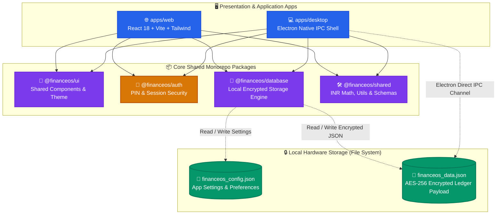
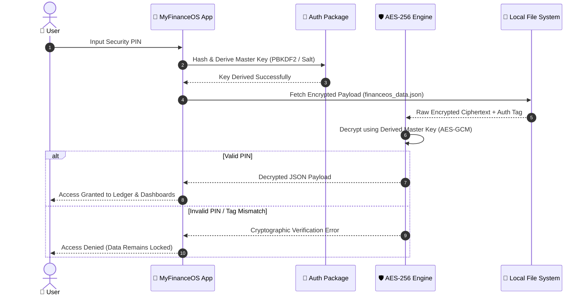
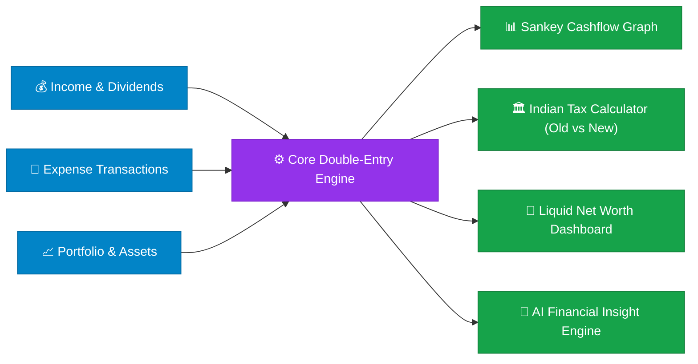

<div align="center">

  

  # MyFinanceOS 🚀

  **Premium Local-First Personal & Business Finance Suite for India**

  *Absolute Data Privacy • AES-256-GCM Encrypted • Zero Cloud Footprint • India-Specific Tax Intelligence*

  ---

  [](https://www.typescriptlang.org/)
  [](https://reactjs.org/)
  [](https://www.electronjs.org/)
  [](https://vitejs.org/)
  [](https://en.wikipedia.org/wiki/Galois/Counter_Mode)
  [](https://vitest.dev/)
  [](LICENSE)

  <br />

  [✨ Features](#-key-features) • [🏗️ Architecture](#%EF%B8%8F-system-architecture) • [🔐 Security & Privacy](#-security--privacy-model) • [💻 Tech Stack](#-technology-stack) • [📁 Monorepo Structure](#-monorepo-structure) • [⚡ Quick Start](#-quick-start-guide)

</div>

---

## 📖 Overview

**MyFinanceOS** is an ultra-secure, local-first financial management system designed specifically for the Indian financial ecosystem. Engineered for high-net-worth individuals, freelancers, and small business owners, MyFinanceOS eliminates third-party cloud dependence by encrypting and persisting all financial records directly on your local machine.

Whether tracking personal net worth across mutual funds, real estate, and equity portfolios or managing dual-entry business ledgers with GST & tax forecasts, MyFinanceOS delivers real-time analytical clarity with zero privacy tradeoffs.

---

## ✨ Key Features

| Feature | Description | Highlight |
| :--- | :--- | :--- |
| 🛡️ **Zero Cloud Storage** | All transaction history, bank ledgers, and accounts remain stored strictly on your local disk. | 100% Privacy |
| 🔐 **AES-256-GCM Encryption** | Military-grade authenticated encryption using your custom Security PIN and Argon2/PBKDF2 key derivation. | Bank-Grade Security |
| 💼 **Dual Business & Personal Modes** | Switch seamlessly between personal wealth management and business cash flows with segregated ledgers. | Multi-Entity |
| 📊 **Sankey Flow Diagram** | Visualize full income-to-expense allocations and capital flows with dynamic node graphs. | Real-Time Visuals |
| 🏛️ **India Tax Optimizer** | Compare tax liabilities under the **Old vs. New Indian Tax Regimes** with 80C, HRA, and deduction tracking. | India Specific |
| 📈 **Multi-Asset Portfolio Tracker** | Track equities, debt instruments, FDs, mutual funds, real estate, and physical assets with liquid net worth metrics. | Net Worth Insights |
| 🤖 **Privacy-First AI Analyst** | Inquire about your financial state using natural language queries analyzed entirely against local data models. | Smart Insights |
| ⚡ **Offline-First Desktop & Web** | Native high-performance experience on Windows desktop or browser environment. | Cross-Platform |

---

## 🏗️ System Architecture

MyFinanceOS operates on a **modular monorepo layout** powered by `npm workspaces`. The core state and cryptographic persistence engine are decoupled into reusable internal libraries (`packages/*`), consumed cleanly by both the browser client (`apps/web`) and the native desktop wrapper (`apps/desktop`).


```mermaid
graph TD
    %% Custom Styling
    classDef client fill:#2563eb,stroke:#1d4ed8,stroke-width:2px,color:#fff;
    classDef core fill:#7c3aed,stroke:#6d28d9,stroke-width:2px,color:#fff;
    classDef storage fill:#059669,stroke:#047857,stroke-width:2px,color:#fff;
    classDef crypto fill:#d97706,stroke:#b45309,stroke-width:2px,color:#fff;

    subgraph ClientLayer["🖥️ Presentation & Application Apps"]
        Web["🌐 apps/web<br/>React 18 + Vite + Tailwind"]:::client
        Desktop["💻 apps/desktop<br/>Electron Native IPC Shell"]:::client
    end

    subgraph PackageLayer["📦 Core Shared Monorepo Packages"]
        UI["🎨 @financeos/ui<br/>Shared Components & Theme"]:::core
        Auth["🔑 @financeos/auth<br/>PIN & Session Security"]:::crypto
        DB["💾 @financeos/database<br/>Local Encrypted Storage Engine"]:::core
        Shared["🛠️ @financeos/shared<br/>INR Math, Utils & Schemas"]:::core
    end

    subgraph StorageLayer["🔒 Local Hardware Storage (File System)"]
        ConfigFile[("📄 financeos_config.json<br/>App Settings & Preferences")]:::storage
        DataFile[("🔐 financeos_data.json<br/>AES-256 Encrypted Ledger Payload")]:::storage
    end

    %% Component Interconnections
    Web --> UI
    Web --> Auth
    Web --> DB
    Web --> Shared

    Desktop --> UI
    Desktop --> Auth
    Desktop --> DB
    Desktop --> Shared

    %% File System Persistence Flow
    DB -.->|Read / Write Encrypted JSON| DataFile
    DB -.->|Read / Write Settings| ConfigFile
    Desktop -.->|Electron Direct IPC Channel| DataFile
```

---

## 🔐 Security & Privacy Model

Your Security PIN never leaves your device memory and is never written to disk in plain text.


```mermaid
sequenceDiagram
    autonumber
    actor User as 👤 User
    participant App as 📱 MyFinanceOS App
    participant Auth as 🔑 Auth Package
    participant Engine as 🛡️ AES-256 Engine
    participant Disk as 💾 Local File System

    User->>App: Input Security PIN
    App->>Auth: Hash & Derive Master Key (PBKDF2 / Salt)
    Auth-->>App: Key Derived Successfully
    App->>Disk: Fetch Encrypted Payload (financeos_data.json)
    Disk-->>Engine: Raw Encrypted Ciphertext + Auth Tag
    Engine->>Engine: Decrypt using Derived Master Key (AES-GCM)
    alt Valid PIN
        Engine-->>App: Decrypted JSON Payload
        App-->>User: Access Granted to Ledger & Dashboards
    else Invalid PIN / Tag Mismatch
        Engine-->>App: Cryptographic Verification Error
        App-->>User: Access Denied (Data Remains Locked)
    end
```

---

## 🔄 Financial Data Pipeline


```mermaid
flowchart LR
    %% Styling
    classDef in fill:#0284c7,stroke:#0369a1,color:#fff;
    classDef calc fill:#9333ea,stroke:#7e22ce,color:#fff;
    classDef out fill:#16a34a,stroke:#15803d,color:#fff;

    Income["💰 Income & Dividends"]:::in --> Engine["⚙️ Core Double-Entry Engine"]:::calc
    Expenses["💸 Expense Transactions"]:::in --> Engine
    Investments["📈 Portfolio & Assets"]:::in --> Engine

    Engine --> Sankey["📊 Sankey Cashflow Graph"]:::out
    Engine --> Tax["🏛️ Indian Tax Calculator (Old vs New)"]:::out
    Engine --> NetWorth["💎 Liquid Net Worth Dashboard"]:::out
    Engine --> AI["🤖 AI Financial Insight Engine"]:::out
```

---

## 💻 Technology Stack

### **Frontend & UI Core**
- **React 18**: Component-driven reactive UI architecture.
- **TypeScript 5.3**: Strict typing across packages and applications.
- **Vite 5.4**: Lightning-fast HMR and bundle compilation.
- **Tailwind CSS & Framer Motion**: Sleek dark mode visuals, glassmorphism, and dynamic micro-animations.
- **Lucide React**: Modern iconography system.

### **Desktop Platform & Storage**
- **Electron 43**: Native OS integration with Windows IPC bindings.
- **IndexedDB & LocalStorage**: Fast client-side storage cache.
- **Web Crypto API**: Native browser hardware-accelerated AES-GCM encryption.

### **Testing & Quality Assurance**
- **Vitest**: Blazing-fast unit test execution.
- **Playwright**: End-to-end integration testing.
- **ESLint & TypeScript**: Code standard enforcement.

---

## 📁 Monorepo Structure

```
MyFinanceOS/
├── 📁 apps/
│   ├── 🌐 web/                  # React + Vite Web Application
│   └── 💻 desktop/              # Electron Native Packaging Shell
│
├── 📁 packages/
│   ├── 🎨 ui/                   # Shared Glassmorphism Component Library
│   ├── 💾 database/             # Encrypted Local Storage Engine & Models
│   ├── 🔑 auth/                 # Local PIN Hashing & Session Management
│   └── 🛠️ shared/               # Universal Utils, INR Currency Math & Types
│
├── 📁 e2e/                      # Playwright End-to-End Test Suite
└── 📄 package.json              # Monorepo Workspace Configuration
```

---

## ⚡ Quick Start Guide

### Prerequisites
- **Node.js**: `v18.0.0` or higher
- **npm**: `v9.0.0` or higher

### Installation

1. **Clone the repository:**
   ```bash
   git clone https://github.com/AnuroopSrivastava/MyFinanceOS.git
   cd MyFinanceOS
   ```

2. **Install workspace dependencies:**
   ```bash
   npm run install:all
   ```

---

## 🛠️ Development & Build Scripts

| Command | Action |
| :--- | :--- |
| `npm run dev` | **Start All**: Launches Web Dev Server (`http://localhost:5173`) & Electron simultaneously |
| `npm run dev:web` | Start Vite Web Application standalone |
| `npm run dev:desktop` | Start Electron Desktop Shell in watch mode |
| `npm run build:libs` | Compile all shared packages (`@financeos/*`) |
| `npm run build:web` | Create production web build in `apps/web/dist` |
| `npm run test` | Run full unit test suite via Vitest |
| `npm run test:e2e` | Run Playwright E2E integration tests |
| `npm run lint` | Execute ESLint across all workspaces |
| `npm run package` | Package native Windows `.exe` desktop installer into `apps/desktop/release` |

---

## 🤝 Contributing

Contributions are welcome! If you'd like to improve MyFinanceOS or add support for additional Indian banking formats or tax rules:

1. Fork the Project Repository.
2. Create your Feature Branch (`git checkout -b feature/AmazingFeature`).
3. Commit your Changes (`git commit -m 'Add some AmazingFeature'`).
4. Push to the Branch (`git checkout -b feature/AmazingFeature`).
5. Open a Pull Request.

---

<div align="center">

  *Built with ❤️ for privacy-minded financial independence in India.*

</div>
