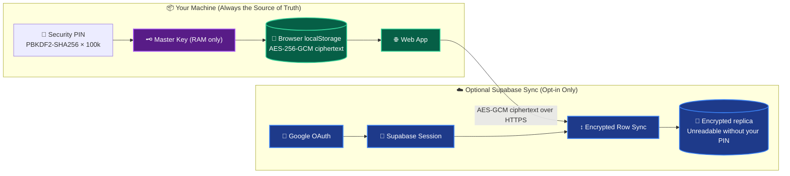
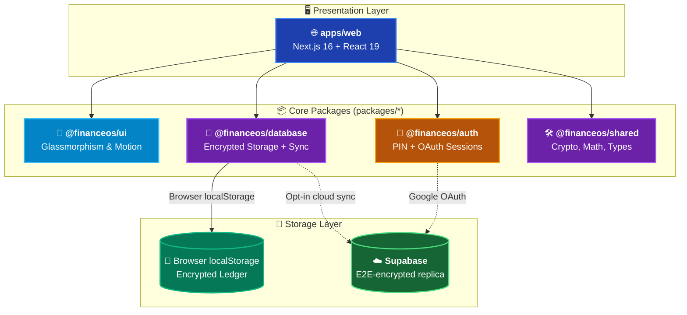
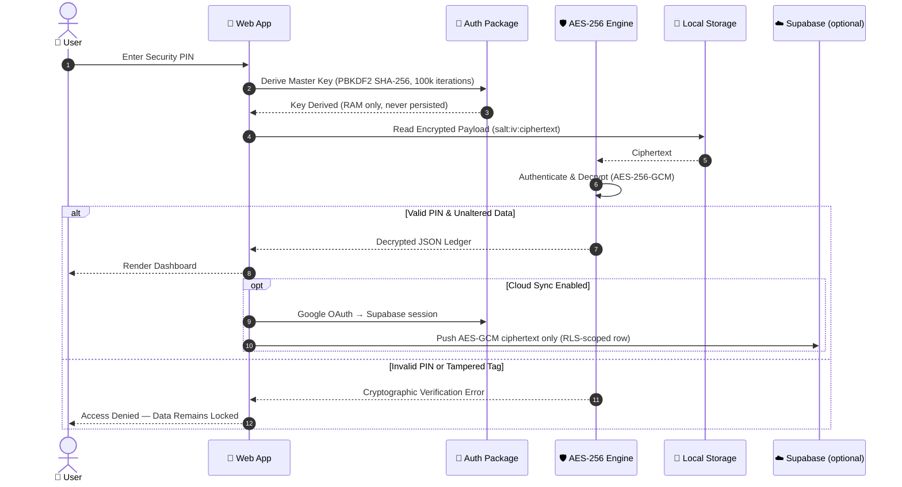

<div align="center">

<a href="https://github.com/AnuroopSrivastava/MyFinanceOS">

</a>

<h1>

# MyFinanceOS

</h1>

<p style="font-size: 1.4rem; color: #a0aec0; margin: 0.5rem 0 1rem 0;">
<b>Premium Local-First Finance Suite for India</b>
</p>

<p style="font-size: 1.1rem; color: #718096; max-width: 600px; margin: 0 auto 1.5rem auto;">
<b>End-to-End Encrypted</b> • <b>Local-First Architecture</b> • <b>60fps Glassmorphism UI</b> • <b>India Tax Intelligence</b>
</p>

<p align="center">
<a href="https://www.typescriptlang.org/"></a>
<a href="https://react.dev/"></a>
<a href="https://nextjs.org/"></a>
<a href="https://www.framer.com/motion/"></a>
<a href="https://supabase.com/"></a>
<a href="https://vitest.dev/"></a>
<br/><br/>
<a href="https://nodejs.org/"></a>
<a href="https://tailwindcss.com/"></a>
<a href="https://en.wikipedia.org/wiki/Galois/Counter_Mode"></a>
<a href="LICENSE"></a>
</p>

<br/>

<p align="center">
<a href="#-overview"><b>Overview</b></a> •
<a href="#-key-features"><b>Features</b></a> •
<a href="#-technology-stack"><b>Tech Stack</b></a> •
<a href="#-quick-start-guide"><b>Quick Start</b></a> •
<a href="#-security--privacy-model"><b>Security</b></a> •
<a href="#-contributing"><b>Contribute</b></a>
</p>

</div>

---

## 📖 Overview

**MyFinanceOS** is a secure, **local-first** financial management platform engineered specifically for the Indian financial landscape. Built for high-net-worth individuals, freelancers, and small business owners, it combines **bank-grade AES-256-GCM encryption** with a **stunning glassmorphism UI** featuring 60fps animations, dynamic themes, and keyboard-driven navigation.

> **Core Philosophy:** Your data lives on your machine first. When you opt-in, it syncs end-to-end-encrypted to **Supabase** so your dashboard follows you across devices — Google OAuth handles identity, the encrypted payload stays unreadable to any third party including us.

### 🎯 Why MyFinanceOS?

| Traditional Finance Apps | MyFinanceOS |
|:---|:---|
| Data stored on vendor servers | **100% local-first** — your browser is the database |
| Subscription fees & lock-in | **Free & open-source** — own your financial data |
| Generic global tax rules | **Built for India** — Old vs New regime, 80C/HRA/80D, GST |
| Plain, utilitarian interfaces | **Premium glassmorphism UI** with 60fps animations |
| Single-device access | **Cross-device sync** via encrypted cloud backup |

---

## ✨ Key Features

<table>
<tr>
<td width="50%">

### 🛡️ Security & Privacy

- **AES-256-GCM Encryption** — Authenticated hardware-accelerated encryption using PBKDF2 (100,000 iterations) derived from your Security PIN
- **Local-First Storage** — All data written to browser's encrypted localStorage first; works fully offline
- **End-to-End Cloud Sync** — When enabled, only ciphertext uploads to Supabase; your PIN never leaves the device
- **Cross-Tab Sync** — Real-time BroadcastChannel synchronization with encrypted payload protection

</td>
<td width="50%">

### 🎨 Premium UI/UX

- **Glassmorphism Design** — Multi-layered backdrop blur, translucent borders, floating elevation
- **60fps Animations** — Fluid page transitions via Framer Motion spring physics
- **Dynamic Themes** — Glass Cyan, Glass Emerald, Glass Gold, Light Mode
- **Command Palette** — Instant keyboard navigation with `Ctrl+K`
- **Micro-Interactions** — Hover-scaled buttons, animated stats, staggered reveals

</td>
</tr>
<tr>
<td width="50%">

### 💰 Personal Finance

- **Multi-Asset Portfolio** — Indian Equities, Mutual Funds, FDs, Gold, Real Estate, US Stocks, Crypto
- **Net Worth Tracking** — Visual analytics with historical growth graphs
- **Goal & FIRE Planner** — Retirement readiness, SIP trackers, loan payoff monitors
- **EMI Calculator** — Amortization schedules, pre-payment impact visualization
- **Document Vault** — Encrypted storage for PAN, Aadhaar, ITR filings

</td>
<td width="50%">

### 🏢 Business & Tax

- **India Tax Optimizer** — Old vs New regime comparison, 80C/HRA/80D deductions
- **Business Ledger** — Dual-entry bookkeeping for freelancers & small businesses
- **GST Invoicing** — CGST, SGST, IGST breakdown with compliant invoices
- **Profit & Loss** — Real-time revenue tracking, expense categorization
- **Sankey Cash Flow** — Interactive income-to-expense allocation visualizer

</td>
</tr>
</table>

---

## 🔀 Dual-Mode Sync Architecture

<table>
<thead>
<tr>
<th width="25%">Mode</th>
<th width="25%">Storage</th>
<th width="25%">Identity</th>
<th width="25%">Best For</th>
</tr>
</thead>
<tbody>
<tr>
<td><b>🖥️ Local-Only</b><br/><i>(default)</i></td>
<td>Browser localStorage<br/><code>salt:iv:ciphertext</code></td>
<td>Local PIN only<br/><i>No account required</i></td>
<td>Privacy purists<br/>Offline work</td>
</tr>
<tr>
<td><b>☁️ Cloud Sync</b><br/><i>(opt-in)</i></td>
<td>Local + Supabase<br/><i>End-to-end encrypted</i></td>
<td>Google OAuth<br/>via Supabase Auth</td>
<td>Multi-device access<br/>Automatic backup</td>
</tr>
</tbody>
</table>


```mermaid
flowchart LR
    classDef local fill:#065f46,stroke:#34d399,stroke-width:2px,color:#fff;
    classDef cloud fill:#1e3a8a,stroke:#3b82f6,stroke-width:2px,color:#fff;
    classDef cipher fill:#581c87,stroke:#a855f7,stroke-width:2px,color:#fff;

    subgraph Device["📦 Your Machine (Always the Source of Truth)"]
        PIN["🔑 Security PIN<br/>PBKDF2-SHA256 × 100k"] --> KEY["🗝️ Master Key (RAM only)"]:::cipher
        KEY --> VAULT[("🔐 Browser localStorage<br/>AES-256-GCM ciphertext")]:::local
        VAULT --> APPS["🌐 Web App"]:::local
    end

    subgraph Cloud["☁️ Optional Supabase Sync (Opt-in Only)"]
        OAuth["🔑 Google OAuth"]:::cloud --> Session["🪪 Supabase Session"]:::cloud
        APPS -->|AES-GCM ciphertext over HTTPS| Sync["↕️ Encrypted Row Sync"]:::cloud
        Session --> Sync
        Sync --> Remote[("🔐 Encrypted replica<br/>Unreadable without your PIN")]:::cloud
    end
```

---

## 🏗️ System Architecture

Modular npm-workspace monorepo with clean separation of concerns:


```mermaid
flowchart TD
    classDef client fill:#1e40af,stroke:#3b82f6,stroke-width:2px,color:#fff;
    classDef uiSys fill:#0284c7,stroke:#38bdf8,stroke-width:2px,color:#fff;
    classDef corePkg fill:#6b21a8,stroke:#a855f7,stroke-width:2px,color:#fff;
    classDef authPkg fill:#b45309,stroke:#f59e0b,stroke-width:2px,color:#fff;
    classDef diskStore fill:#047857,stroke:#10b981,stroke-width:2px,color:#fff;
    classDef cloud fill:#166534,stroke:#4ade80,stroke-width:2px,color:#fff;

    subgraph AppLayer["🖥️ Presentation Layer"]
        Web["🌐 <b>apps/web</b><br/>Next.js 16 + React 19"]:::client
    end

    subgraph PackageLayer["📦 Core Packages (packages/*)"]
        UI["🎨 <b>@financeos/ui</b><br/>Glassmorphism & Motion"]:::uiSys
        Auth["🔑 <b>@financeos/auth</b><br/>PIN + OAuth Sessions"]:::authPkg
        DB["💾 <b>@financeos/database</b><br/>Encrypted Storage + Sync"]:::corePkg
        Shared["🛠️ <b>@financeos/shared</b><br/>Crypto, Math, Types"]:::corePkg
    end

    subgraph StorageLayer["💾 Storage Layer"]
        LocalStore[("🔐 Browser localStorage<br/>Encrypted Ledger")]:::diskStore
        Supabase[("☁️ <b>Supabase</b><br/>E2E-encrypted replica")]:::cloud
    end

    Web --> UI & Auth & DB & Shared
    DB -->|Browser localStorage| LocalStore
    DB -.->|Opt-in cloud sync| Supabase
    Auth -.->|Google OAuth| Supabase
```

### 📁 Project Structure

```
MyFinanceOS/
├── 📁 apps/
│   └── 🌐 web/                  # Next.js 16 App Router application
│       ├── app/                 # Routes: pages, API, auth callback
│       ├── src/                 # React components, hooks, utilities
│       │   ├── components/      # Feature modules (Dashboard, Tax, etc.)
│       │   └── utils/           # Helpers, services, AI integration
│       └── public/              # Static assets, privacy policy, terms
│
├── 📁 packages/                 # Shared monorepo packages
│   ├── 🎨 ui/                   # Glassmorphism system, animations, themes
│   ├── 💾 database/             # Encrypted storage engine + Supabase sync
│   ├── 🔑 auth/                 # PIN/PBKDF2 sessions + Google OAuth
│   └── 🛠️ shared/               # AES-GCM crypto, INR math, TypeScript types
│
├── 📁 e2e/                      # Playwright end-to-end tests
├── 📄 package.json              # Workspace root with dev scripts
└── 📄 README.md                 # You are here
```

---

## 💻 Technology Stack

### Frontend & UI

| Technology | Purpose |
|:---|:---|
| **React 19** | Concurrent rendering, custom hooks, Server Components |
| **Next.js 16** | App Router, server-side rendering, API routes |
| **TypeScript 5.3** | Strict typing across the entire monorepo |
| **Framer Motion 12** | Fluid UI transitions, layout animations, gesture handling |
| **Tailwind CSS** | Utility-first styling with custom glassmorphism tokens |
| **Recharts** | Interactive charts for net worth, allocation, cash flows |
| **Lucide React** | Beautiful, consistent iconography |

### Backend & Sync

| Technology | Purpose |
|:---|:---|
| **Supabase** | PostgreSQL-backed encrypted blob storage + Google OAuth |
| **Web Crypto API** | AES-256-GCM encryption + PBKDF2 key derivation |
| **BroadcastChannel API** | Cross-tab encrypted state synchronization |

### Testing & Quality

| Technology | Purpose |
|:---|:---|
| **Vitest** | 160+ unit tests including security & encryption suites |
| **Playwright** | End-to-end integration tests |
| **ESLint** | Code quality and consistency enforcement |

---

## 🔐 Security & Privacy Model

### Encryption Flow


```mermaid
sequenceDiagram
    autonumber
    actor User as 👤 User
    participant App as 📱 Web App
    participant Auth as 🔑 Auth Package
    participant Engine as 🛡️ AES-256 Engine
    participant Local as 💾 Local Storage
    participant Cloud as ☁️ Supabase (optional)

    User->>App: Enter Security PIN
    App->>Auth: Derive Master Key (PBKDF2 SHA-256, 100k iterations)
    Auth-->>App: Key Derived (RAM only, never persisted)
    App->>Local: Read Encrypted Payload (salt:iv:ciphertext)
    Local-->>Engine: Ciphertext
    Engine->>Engine: Authenticate & Decrypt (AES-256-GCM)

    alt Valid PIN & Unaltered Data
        Engine-->>App: Decrypted JSON Ledger
        App-->>User: Render Dashboard
        opt Cloud Sync Enabled
            App->>Auth: Google OAuth → Supabase session
            App->>Cloud: Push AES-GCM ciphertext only (RLS-scoped row)
        end
    else Invalid PIN or Tampered Tag
        Engine-->>App: Cryptographic Verification Error
        App-->>User: Access Denied — Data Remains Locked
    end
```

### Security Guarantees

| Guarantee | Implementation |
|:---|:---|
| **PIN Never Stored** | Derived key exists only in RAM during session |
| **No Plaintext Cloud Upload** | Payload is encrypted before leaving the browser |
| **Tamper Detection** | AES-GCM authentication tag verifies data integrity |
| **Forward Secrecy** | Fresh salt + IV for every encryption operation |
| **Brute-Force Resistance** | 100,000 PBKDF2 iterations + Argon2id for PIN hashing |

> ⚠️ **Important:** If you ever committed secrets to Git, rotate them immediately in their respective dashboards. Git history retains all data.

---

## 🚀 Quick Start Guide

### Prerequisites

- **Node.js** `v18+` (optimized for **Node 22.x LTS**)
- **npm** `v9+` or **pnpm** `v8+`

### Installation

```bash
# Clone the repository
git clone https://github.com/AnuroopSrivastava/MyFinanceOS.git
cd MyFinanceOS

# Install dependencies
npm run install:all
```

### Environment Variables

Copy `apps/web/.env.example` to `apps/web/.env`:

```bash
cp apps/web/.env.example apps/web/.env
```

| Variable | Purpose | Required? |
|:---|:---|:---:|
| `NEXT_PUBLIC_GOOGLE_CLIENT_ID` | Google OAuth client ID | For cloud sync |
| `NEXT_PUBLIC_SUPABASE_URL` | Supabase project URL | For cloud sync |
| `NEXT_PUBLIC_SUPABASE_ANON_KEY` | Supabase anon key (RLS-scoped) | For cloud sync |
| `NEXT_PUBLIC_WEB3FORMS_ACCESS_KEY` | Contact form integration | For hosted web |

> **Note:** The app runs fully in **local-only mode** without any environment variables. Cloud features are gracefully disabled.

### Development Commands

| Command | Action |
|:---|:---|
| `npm run dev` | Start Next.js dev server at `http://localhost:3000` |
| `npm run build:libs` | Compile shared packages (`@financeos/*`) |
| `npm run build:web` | Production build for hosted deployment |
| `npm run test` | Run 160+ Vitest unit tests |
| `npm run test:e2e` | Execute Playwright E2E tests |
| `npm run lint` | Run ESLint across the monorepo |

---

## 🎨 Theme Gallery

MyFinanceOS ships with 4 stunning themes:

| Theme | Description |
|:---|:---|
| 🌊 **Glass Cyan** | Deep slate dark with cyan accents — *Default* |
| 🌿 **Glass Emerald** | Soft dark with emerald green highlights |
| 👑 **Glass Gold** | Warm luxury dark with amber/gold tones |
| ☀️ **Light Mode** | Crisp high-contrast for daytime use |

Themes are persisted in browser localStorage and sync across tabs in real-time.

---

## 📊 Feature Deep Dive

### 🏛️ India Tax Optimizer (FY 2024-25 / AY 2025-26)

- **Regime Comparison** — Side-by-side Old vs New tax regime calculations
- **Deductions** — Section 80C (₹1.5L), 80D, 80CCD(1B) NPS (₹50k), HRA exemption
- **Capital Gains** — STCG vs LTCG tax projections for equities and mutual funds
- **Real-Time Updates** — Instant recalculation as you input salary and deductions

### 📐 EMI & Amortization Engine

- **Full Schedule** — Month-by-month principal vs interest breakdown
- **Pre-Payment Simulator** — Visualize interest savings and tenure reduction
- **Multiple Loan Support** — Home loans, car loans, personal loans

### 🏢 Business Ledger

- **Dual-Entry Bookkeeping** — Professional accounting for freelancers
- **GST-Compliant Invoices** — CGST, SGST, IGST auto-calculation
- **Quarterly Advance Tax** — Estimated tax projections

---

## 🤝 Contributing

Contributions are welcome and appreciated!

1. **Fork** the repository
2. **Create** a feature branch (`git checkout -b feature/AmazingFeature`)
3. **Commit** your changes (`git commit -m 'Add AmazingFeature'`)
4. **Push** to the branch (`git push origin feature/AmazingFeature`)
5. **Open** a Pull Request

Please ensure all tests pass and lint is clean before submitting:

```bash
npm run test
npm run lint
```

---

## 📄 License

This project is licensed under the **MIT License** — see the [LICENSE](LICENSE) file for details.

---

## 🙏 Acknowledgments

- **Supabase** for the incredible backend-as-a-service platform
- **Vercel** for seamless Next.js hosting
- **Framer** for the powerful motion library
- **The React Team** for the amazing React 19 release

---

<div align="center">

<br/>

**Built with ❤️ for privacy-minded financial independence in India.**

<br/>

<p>
<a href="#top">⬆️ Back to Top</a>
</p>

</div>
